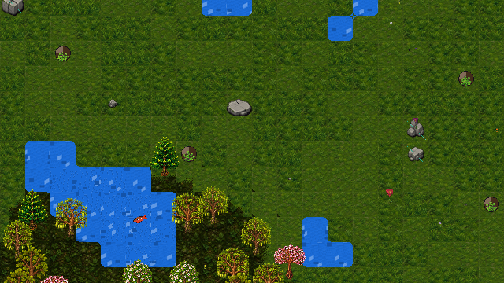
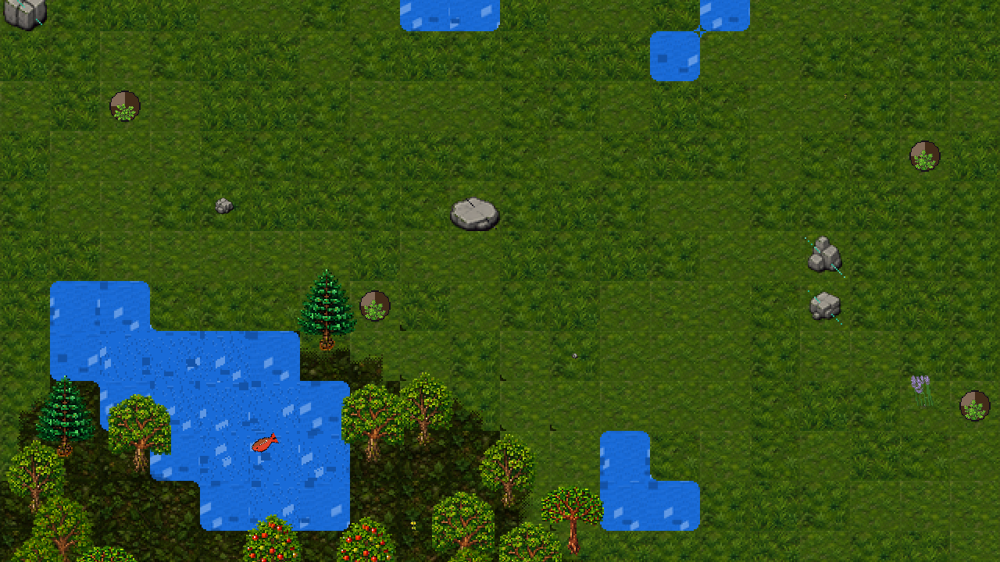
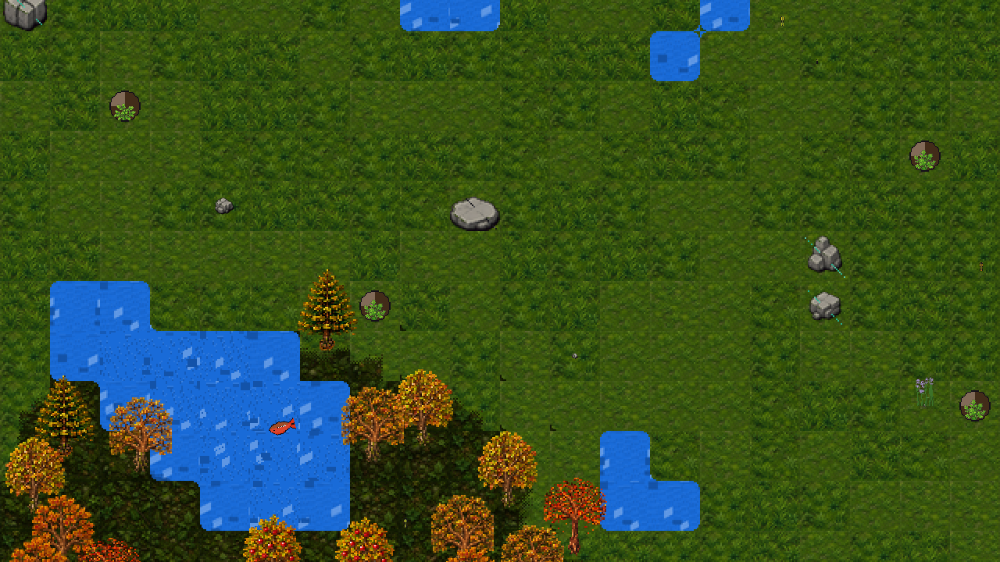
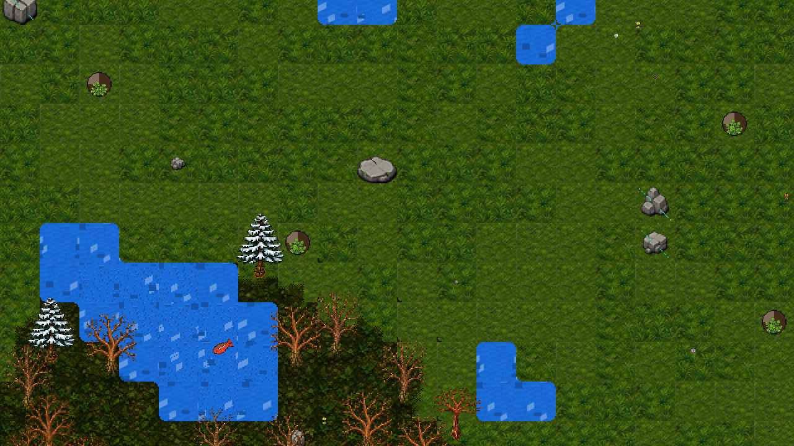

# Aleph Alpha

> A proprietary, non-commercial alpha game.

A single-player-first survival RPG set on a **real, simulated Earth** — actual
elevation and climate data, a real day/night and season cycle, and an
ecosystem where animals live where conditions genuinely support them rather
than where a designer placed a spawner. Everything from a fruit tree's
ripening to a village blacksmith's growing skill runs on the same underlying
idea: **let simulation produce content, don't author it.**

Built solo/part-time in Godot 4 (GDScript), strict test-driven development
throughout.

## Overview

Aleph Alpha is an experimental game about exploring systems, possibilities,
and the consequences of your choices. It is built as a living alpha:
mechanics, content, presentation, and balance will evolve as the project
develops.

The game is designed to reward curiosity rather than prescribe a single
correct way to play. Experimentation, observation, adaptation, and
interpretation are central to the experience. Concretely, that means:

- The world is a real, running simulation — terrain, climate, seasons, plant
  growth, animal populations, and (increasingly) NPC society all keep
  happening whether or not you're watching. Walk far enough and you're not
  loading a new hand-placed area; you're looking at the *same simulation*
  running somewhere else on the same planet.
- There's no invisible spawn table deciding what's around you. A boar is
  where boars can actually thrive right now — enough vegetation, enough
  water, a mild enough season — and that can shift as the world does.
- Crafting, combat, magic, and even how NPCs are instructed all reduce to
  one shared idea: **compose small primitives, let deterministic simulation
  resolve what they produce together.** Nobody enumerated every possible
  sword; the physics of the materials and shape you chose did.

## Philosophy

A handful of principles show up again and again across every system in this
project, not as marketing copy but as the actual, repeated design decision:

- **Real mechanisms, not scripted spawns.** *"A worm is at the surface
  because the soil is moist and mild, not because a timer fired"* — and the
  same sentence, nearly verbatim, is the reasoning behind fruiting trees,
  storms, footpaths, and even how a village's form of government emerges. If
  something exists in this world, there's a simulated reason it does.
- **Two fidelities, one truth.** The ecosystem, the atmosphere, and even the
  passage of time itself all use the same shape: individually-simulated
  detail wherever you're actually looking, a cheap aggregate model
  everywhere else, seeded so the two never disagree. A region you left keeps
  living without you, and catches back up the moment you return — nothing
  freezes, nothing resets.
- **Composed primitives over authored content.** *"We do not hardcode 'iron
  sword = 12 damage'"* — item stats emerge from a material's real physical
  properties and shape; spells are built from dozens of narrow atomic
  effects, not a menu of fixed verbs; a world boss is the *same* population
  simulation that makes ordinary animals ordinary, occasionally producing
  something exceptional — never a separate, bolted-on system.
- **Real-world grounding.** Mechanics borrow actual terminology and actual
  mechanisms from the real world instead of inventing gamey abstractions: a
  worn dirt path is a literal *desire path*, the term ecologists and urban
  planners use for the same thing; smelting follows real metallurgy (ore +
  reducing fuel + sustained heat); taming an animal follows the real order
  natural horsemanship does (restrain → hold → habituate → reward).
- **Determinism over dice rolls.** Simulation is seeded and reproducible; a
  crafted item's stats are the deterministic output of exactly what you fed
  in, not a random roll; spell cost is a pure function of the atoms and
  parameters chosen — there's no way to express "big effect for free," the
  system literally can't represent it.
- **Soft gates, never hard walls.** Nothing is permanently locked out of
  reach. Your class is a starting lens, not a cage — any character can
  eventually learn any spell or master any archetype, a mismatched choice
  just makes the road longer. There are no unique key-item traversal
  unlocks; every tool for getting around is craftable from the same shared
  material grammar as everything else.

These principles describe the project's direction, not a guarantee that
every current feature fully represents the intended final experience. As an
alpha, some systems are incomplete, unstable, intentionally opaque, or
subject to significant change. Progress, balance, and saved data may not be
preserved between versions.

## Screenshots

*(placeholders — to be added)*


*A real biome, populated by the ecosystem simulation rather than hand-placed spawns.*


*A procedurally placed settlement, its NPCs going about self-directed daily routines.*


*The player's inventory/equipment window.*


*Gathering materials and crafting gear at a station.*


*Biome borders blending organically instead of a hard grid seam.*

### The same landscape, four seasons

The exact same patch of forest, one real in-game year apart each shot —
canopy color, blossom, fruit, and bare winter branches all come from the
live season simulation (`SeasonCycle`), not a swapped texture set.

| Spring | Summer |
| --- | --- |
|  |  |

| Autumn | Winter |
| --- | --- |
|  |  |

## What you can actually do

A tour through the game's systems, grouped by what they're about. Every
mechanic below maps to something already built or already fully designed —
see [Current State](#current-state-what-actually-works-today) for what's
live today versus what's still on paper.

### A world that runs whether or not you're looking at it

The planet is generated from real elevation and climate data (a genuine
slice of Earth, toroidal — walk far enough in one direction and you come
back around), with a real day/night cycle and four-season year that every
growth and weather system reads from. Vegetation grows by sunlight and
moisture into a cellular density field; herbivores and predators live off
that density and off each other, individually simulated near you and
cheaply aggregated everywhere else. Fruit ripens on trees on a real
phenology clock — pick it too early and it's not ready; miss the window and
it's fallen and rotting (which, in turn, breeds flies — a population whose
entire food source is decay you caused). Seeds disperse by wind or by the
animals that eat the fruit, so a meadow colonizes open ground faster than a
forest's heavier acorns do, purely from how far each one can actually
travel. Weather brings real storms, droughts, and wildfires with mechanical
teeth, not just atmosphere.

### Character, class, and two separate kinds of getting better

Pick one of seven broad archetypes at creation — Warrior, Mage, Ranger,
Beastmaster, Artisan, Herbalist, Overseer — as a starting lens, not a lock.
From there, two entirely separate progression tracks run in parallel:

- A **Path-of-Exile-style passive web**, spent from skill points earned by
  leveling up, for combat and magic build power. Every character also
  carries one procedurally DNA-seeded signature ability nobody else has.
- **Use-based labor mastery** — fell a hundred trees, get measurably better
  at felling trees. Ten practical skills (Woodcutting, Mining, Fishing,
  Foraging, Farming, Herbalism, Cooking, Smithing, Construction, Animal
  Handling) level purely from doing the corresponding action, no points to
  spend. Crucially, this is the *same code* NPCs run — a village blacksmith
  who's forged for years has a real, growing skill level, and a player who
  commits real hours to Smithing can and eventually will out-craft them.

Both a player's and an NPC's underlying genetics are modeled with real DNA —
stats, traits, and looks all derive from it, and it's inherited by children
in a genuine (if imperfect) eugenics layer. Death is real but forgiving:
nine lives, the last one is permanent.

### Gathering, crafting, and a shared physics for what things are

The base loop is familiar — gather, craft, build — but recipes aren't a
fixed picklist. A **blueprint DSL** combines a base template with material
inputs and modifier slots to deterministically produce an item's stats,
built toward a deeper target: item properties *emerging* from a material's
real physical property vector (density, hardness, sharpness, ...) crossed
with its shape, rather than any stat block anyone authored by hand. A rare,
high-fitness boar's hide is measurably better crafting material than a
common one's — hunting and taming feed crafting power, not just a
collection. Ore must be smelted before it's useful, heat-gated exactly like
cooking; a crafter's own skill level sets the *ceiling* on how much of an
item's theoretical potential actually gets realized. Farming, wild crops,
and even long grass all run through the same underlying vegetation
population machinery the wild ecosystem uses — nothing about "player farms"
is a separate system bolted onto the world.

### Taming, and creatures worth keeping

Catching a wild animal is a real rope-and-hold contest, not a single click
to convert it — and an animal you caught an hour ago and then ignored is
still wild. Trust builds from repeatedly showing up when it's hungry, over
real elapsed time. Once tamed, a companion's *role* is fixed by species but
its *performance* is DNA-driven — the same fitness dimension that makes a
wild individual strong in the ecosystem is exactly what makes it worth
taming. Wild populations undergo real sexual selection: each species has an
"attractive phenotype" that itself drifts generation over generation based
on who actually bred, so taming (or hunting) rare individuals is a genuine,
measurable pressure on the wild gene pool, not flavor text.

### Combat and a Morrowind-style spellcrafting DSL

Real-time arcade combat (Hammerwatch pacing) layered with a few genuinely
2D-achievable tactical elements — knockback into hazards, spreadable
fire/oil, vegetation concealment that's tied directly into the live
ecosystem simulation, so a lush biome plays differently than a barren one by
construction, not by a difficulty flag. Spells are built from dozens of
narrow atomic effects rather than a handful of coarse verbs; a spell's mana
and cast-time cost is a deterministic function of exactly which atoms and
parameters you chose — there's no way to build a big effect for free, the
system can't express it. Occasionally, the same population/fitness
simulation that governs ordinary wildlife produces a genuinely exceptional
individual that becomes a real world-boss-tier threat — emergent from that
save file's own population history, so no two worlds produce the same boss
in the same place.

### A society that plans for itself

NPCs are individually modeled — identity, personality, needs, occupation —
and (in the target design) planned once per in-game day by an LLM call, then
executed cheaply by a local FSM the rest of the day with zero further LLM
involvement, replanning only on a real interrupt (combat, a notable
encounter, a need crossing a threshold). Settlement reputation isn't a
separate hidden meter; it's the honest aggregate of your real relationships
with individual villagers. Quests are never authored — they only exist
because a real shortage, threat, or need already exists in the simulation;
disable the quest system and the underlying problem it was describing is
still there, because it was never separate from it. A persistent event/
causality substrate underlies all of this: every recorded thing that
happens can be traced back to why it happened, in-game, via console
commands (`/history`, `/why`) — no reading source code required. On top of
this substrate, a labor-skill-aware auction house lets you buy a better
weapon than you can currently forge yourself from a settlement's own master
craftsperson — the same mechanism that, later, lets real players list goods
for each other once multiplayer exists.

## Current state: what actually works today

This is a solo/part-time alpha, and it's honest about being one. Today,
live and playable:

- A real, large slice of Earth generated from actual elevation/climate data,
  toroidal, with day/night and seasons, chunk save/load.
- The most complete system in the game: individually-simulated wildlife
  (12+ species with real flee/hunt/graze/drink AI) living where the
  ecosystem simulation actually supports them, backed by an aggregate
  population model for anywhere you're not currently standing.
- Procedurally placed villages with deterministic daily-plan-driven NPCs, a
  working village-scale hunger/production economy, and basic shopping — no
  live LLM integration yet (a deterministic stand-in fills that role for
  now).
- Real inventory/equipment, material-aware melee combat with knockback, a
  primitive crafting/knapping chain, and Terraria-style tile building/
  destruction that survives a save/reload.
- A persistent, queryable event-causality substrate underlying NPC memory,
  households, contracts, settlement growth/decline, and the first slice of
  emergent quests.

Not yet live: magic, the labor-skills mastery track described above,
multiplayer (netcode exists but is unverified against a live blocker), the
auction house, era progression, and most of the deeper social/political
layers. See [`docs/progress.md`](docs/progress.md) for the full,
mechanism-by-mechanism ✅/🚧/⬜ ledger, and [`docs/concept/`](docs/concept/)
for the full design corpus this overview is a tour of.

## Roadmap / future ideas

Development proceeds in phases, each meant to end in something actually
playable, not just infrastructure — see
[`docs/roadmap.md`](docs/roadmap.md) for the full detail (including a much
more granular emergence-substrate sub-roadmap covering NPC memory,
households, institutions, settlements, dungeons, and world bosses, most of
which is designed and substantially underway).

- **Phase 0 — Foundations** ✅ largely done: world generation, chunk save/
  load, day/night.
- **Phase 1 — Living ecosystem** ✅ the most mature phase: population models,
  individual/aggregate promotion, real wildlife AI.
- **Phase 2 — NPC AI** 🚧 a first real slice live (villages, daily plans,
  basic economy); LLM-backed planning/dialogue and memory/lifecycle still
  ahead.
- **Phase 3 — Core gameplay loop** 🚧 combat and building are real; no armor
  variety, fire/hazard interaction, or layered elevation combat yet.
- **Phase 4 — Emergent quests** 🚧 the first quest type (production
  shortfall) is live as a pure projection over real simulation state; more
  quest sources and the full promotion/representative flow are still ahead.
- **Phase 5+ — Post-MVP**: multiplayer, a player-driven economy and auction
  house, era progression (medieval → industrial → AI boom → space) via a
  reincarnation mechanic, and eventually a multi-planet/galaxy layer with
  procedurally generated planets of varying rarity.

Some specific ideas on deck, beyond what's already fully designed above:

- The **labor-skills mastery track** and its crafting-quality hook — the
  next concrete implementation target once this design lands.
- Full LLM-backed NPC daily planning and live dialogue, replacing today's
  deterministic stand-in.
- A real auction house UI on top of the already-built per-settlement market,
  with crafter-identity-aware listings.
- Deepening the emergent-quest system beyond its first (production-shortfall)
  source: settlement endangerment, safety/social needs, and world-boss
  threats all already have designed causal hooks waiting to be wired.
- Whole-planet scale — expanding from today's prototype region toward the
  full generated Earth, using the exact same systems (a performance/content
  scaling exercise, not a new architecture).

## Running the Game

Aleph Alpha is built with [Godot Engine](https://godotengine.org/) 4.3 or
later (GDScript). To run the alpha locally:

1. Install Godot 4.3+ from
   [godotengine.org/download](https://godotengine.org/download) (the
   standard, non-.NET build is sufficient; the project doesn't use C#).
2. Clone or download this repository:
   `git clone https://github.com/269652/aleph-alpha.git`
3. Open Godot, choose **Import**, and select the `project.godot` file in the
   cloned folder.
4. With the project open in the editor, press **F5** (or click the **Play**
   button in the top-right corner) to launch the game — the main scene
   (`scenes/world.tscn`) is already configured, so it launches straight into
   the world. The first launch may take a moment while Godot imports assets
   and caches shaders.

Running from the editor is the supported way to play the alpha; there are
currently no pre-built binary releases. Since this is an early alpha, expect
occasional errors in the Godot debugger console — these are useful to
report (see Contact below) but generally shouldn't block play. Once in
game, press the backtick/tilde key (or whichever key your layout maps to
it) to open the in-game dev console for commands like `/help`, `/spawn`,
`/give`, `/village`, and `/weather` — useful for exploring systems quickly
rather than waiting on them to occur naturally.

## License Key (for exported/downloaded builds)

Running from the Godot editor (the method above) never requires a license
key. An exported build, however, refuses to start without a valid
`license.txt` file (containing just the serial code below, nothing else)
placed next to the game's executable.

A 7-day trial key, valid through **2026-08-31**, base game only:

```
040G00000000004HBW0G0064JHN6QKTH8QRE7WR5
1P8SY9HD487AM5M5TC0K2YD5NRV4MEX448ZC86TJ
TJB9SKNZ6Z93YPHRYAN9D5JQ8JRWC7SXM3HPTVDZ
4091AXMDENKGH504M3169T326R8G999NTNSX10TR
YHWJR6X6BD6YXC1DH1AAXE4EYSA2H72QX3296Q3T
ASMENMMX7EJKPJQDKF97BNVV7ZGAVMNDY7NA5GBE
KW91VRFNFTCGFY5KC3P3VABS5B6MZ1XYWMBGJ7AS
BYXX7BYGTDKF68R6ZX8K4FJTWX15F4TYKKE0SRTB
SA909Y903P02KG22TVDQMRP0Z824DJC2RCM1F9N8
VDPSWTKK686JKCG4F3635SV8A840E9H6507AJEJS
S4EXDK17KAAJ4M1Q3D38J2FF9H2ESYZXJ823Y
```

Paste the whole block (line breaks are fine) into a plain-text file named
`license.txt` next to the game executable. After it expires, contact us
(see Contact below) for an alpha tester key.

The game also verifies its own files haven't been tampered with at
startup (see `docs/licensing.md`). **Removing or bypassing this signature
verification is expressly prohibited** under the license terms below, in
addition to being enforced technically (see `docs/licensing.md`'s
"Key-swap resistance" for what happens if you try).

## Private Alpha Use

The copyright holder grants private individuals a limited, personal,
non-exclusive, non-transferable, revocable license to download, install,
and play the alpha solely for personal, non-commercial purposes.

You may not sell, rent, sublicense, publish, publicly distribute,
commercially exploit, or use the game, its content, code, assets,
characters, story, audiovisual materials, trademarks, or branding in
connection with any commercial activity. You may not remove, disable,
circumvent, or attempt to defeat the game's license key or signature
verification checks. You may not modify, reverse
engineer, decompile, disassemble, or create derivative works except where
applicable law expressly permits it.

This permission does not transfer ownership or any intellectual-property
rights. All rights not expressly granted are reserved by the copyright
holder. Please do not redistribute alpha builds; share the repository or an
authorized access method instead.

## Ownership and Contributions

Unless a separate written agreement says otherwise, all original game code,
artwork, audio, writing, designs, characters, lore, trademarks, and other
materials in this repository are proprietary and remain the exclusive
property of the copyright holder. Third-party materials, if any, remain
subject to their respective licenses and are not covered by this license.

By submitting a contribution, you confirm that you have the necessary
rights to submit it and grant the copyright holder a perpetual, worldwide,
royalty-free, transferable, sublicensable license to use, reproduce,
modify, distribute, publicly display, perform, and commercially exploit
that contribution as part of the game or related products. If you do not
agree, do not submit contributions.

Repo write access is by application, not open to unsolicited PRs — see
[CONTRIBUTING.md](CONTRIBUTING.md) for how to apply and what's expected
once you're in.

## Disclaimer

THE GAME IS PROVIDED “AS IS” WITHOUT WARRANTIES OF ANY KIND, TO THE MAXIMUM
EXTENT PERMITTED BY LAW. THE COPYRIGHT HOLDER IS NOT LIABLE FOR DAMAGES
ARISING FROM USE OF THE GAME, EXCEPT TO THE EXTENT LIABILITY CANNOT
LAWFULLY BE EXCLUDED.

## Contact

For permission requests, licensing inquiries, or bug reports, open an issue
or contact the copyright holder through the repository owner’s GitHub
profile.

## License

See [LICENSE.md](LICENSE.md). This is a custom proprietary license, not an
open-source license.
