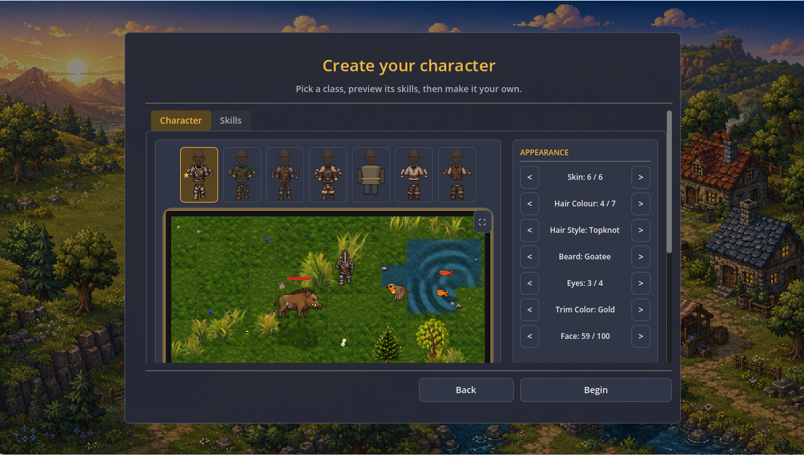
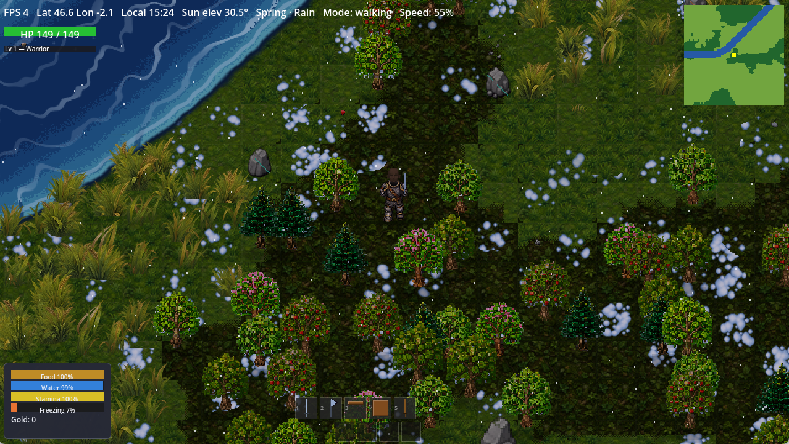
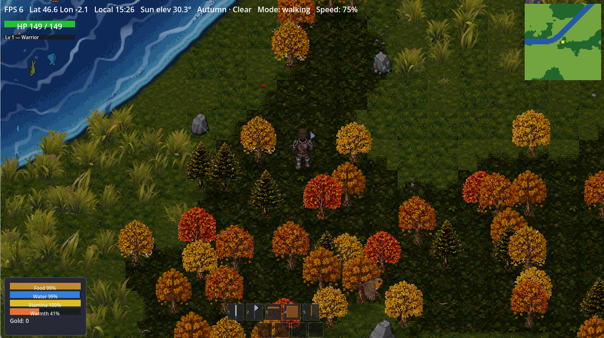
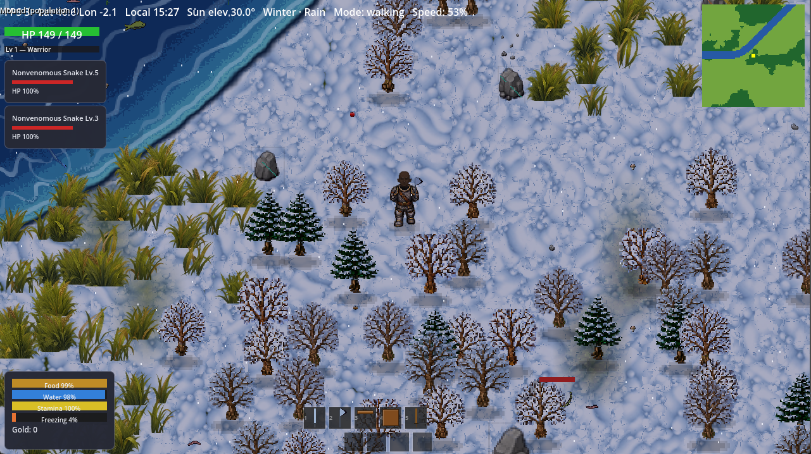

# Aleph Alpha



> A proprietary, non-commercial alpha game.

A single-player-first survival RPG set on a real, simulated Earth — actual elevation and climate data, a real day/night and season cycle, and a planet that keeps turning whether or not you're watching.

Walk these woods in autumn and every birch is going gold at its own pace, leaves catching the wind on the way down in a way nobody keyframed by hand. The path underfoot is there because feet wore it in, one crossing at a time. A kingfisher holds its perch over the river because the water holds fish and the bank gives it a ledge to dive from — not because a designer decided a kingfisher belonged there. Snow comes and goes with the season it belongs to, not a switch somebody flips.




Built solo/part-time in Godot 4 (GDScript), strict test-driven development
throughout.

## Overview

Aleph Alpha is an experimental game about exploring systems, possibilities,
and the consequences of your choices. It is built as a living alpha:
mechanics, content, presentation, and balance will evolve as the project
develops.

The game is designed to reward curiosity rather than prescribe a single
correct way to play. Experimentation, observation, adaptation, and
interpretation are central to the experience. Concretely, that means:

- The world is a real, running simulation — terrain, climate, seasons, plant
  growth, animal populations, and (increasingly) NPC society all keep
  happening whether or not you're watching. Walk far enough and you're not
  loading a new hand-placed area; you're looking at the *same simulation*
  running somewhere else on the same planet.
- There's no invisible spawn table deciding what's around you. A boar is
  where boars can actually thrive right now — enough vegetation, enough
  water, a mild enough season — and that can shift as the world does.
- Crafting, combat, magic, and even how NPCs are instructed all reduce to
  one shared idea: **compose small primitives, let deterministic simulation
  resolve what they produce together.** Nobody enumerated every possible
  sword; the physics of the materials and shape you chose did.

Design docs live in [`docs/concept/`](docs/concept/); the honest,
mechanism-by-mechanism implementation status is
[`docs/progress.md`](docs/progress.md), and the phase plan is
[`docs/roadmap.md`](docs/roadmap.md).

## Running the Game

Requires [Godot](https://godotengine.org/download) 4.7 (the standard,
non-.NET build -- the project doesn't use C#). From the repo root:

```bash
godot --path .
```

That opens a play window directly on the main scene. If `godot` isn't on your
PATH, call the binary by its full path instead, e.g.
`"C:/Godot/Godot_v4.7-stable_win64.exe" --path .`

The first launch shows the in-game license screen -- paste the key below.

## License Key

The game refuses to build the world without a valid license: an invalid or
missing key shows an in-game "enter your license key" screen instead. Paste a
key below into that screen and it saves itself, no file to place by hand. (A
`license.txt` holding just the serial code, in Godot's `user://` data
directory or next to the running executable, works too.)

A 7-day trial key, valid through **2026-08-31**, base game only:

```
040G00000000004HBW0G0064JHN6QKTH8QRE7WR5
1P8SY9HD487AM5M5TC0K2YD5NRV4MEX448ZC86TJ
TJB9SKNZ6Z93YPHRYAN9D5JQ8JRWC7SXM3HPTVDZ
4091AXMDENKGH504M3169T326R8G999NTNSX10TR
YHWJR6X6BD6YXC1DH1AAXE4EYSA2H72QX3296Q3T
ASMENMMX7EJKPJQDKF97BNVV7ZGAVMNDY7NA5GBE
KW91VRFNFTCGFY5KC3P3VABS5B6MZ1XYWMBGJ7AS
BYXX7BYGTDKF68R6ZX8K4FJTWX15F4TYKKE0SRTB
SA909Y903P02KG22TVDQMRP0Z824DJC2RCM1F9N8
VDPSWTKK686JKCG4F3635SV8A840E9H6507AJEJS
S4EXDK17KAAJ4M1Q3D38J2FF9H2ESYZXJ823Y
```

After it expires, contact us (see Contact below) for an alpha tester key.

An extended key, valid through **2027-12-31**, base game only:

```
040G0000000000020000106E2SPS9ZQ7ZMY5Z6BN
FKS1YAGH03CPYZMF1QGR0JP33S1W3S3FETB4EARA
MPFYQYGJK2MRB6S8T9BCV4HBDJRVS3KZ48QA3WA1
WE0D86WGZ924388T3ZD9QEV52GS83SWYZPFA3GZJ
YX9FK5KZ80EGGA3D1Z9Q83F9Y6YH0FA792TQZBCH
4SNDYS3W1B49VV6P044KT24CSTBBZY6XAK7MHATG
1HRKYMANZ8BZHKQYPQYSK5GHMEF1SF1X9047ZF9R
0SCCYHBT5EWQ7ZDT85ARYGTKVM96XCXM7E316XBK
KFN68JF1XFDVDBWTYRWYW8ECKRKD6B6MBRCW1STQ
0V5DH0RFVKGG1KFKVK6D636VXYTA0G5EEAQXBW3S
60K69MG8ETM352FY523FCSQP5HXPZV28FFR9C
```

The game also verifies its own files haven't been tampered with at
startup (see `docs/licensing.md`). **Removing or bypassing this signature
verification is expressly prohibited** under the license terms below, in
addition to being enforced technically (see `docs/licensing.md`'s
"Key-swap resistance" for what happens if you try).

## Private Alpha Use

The copyright holder grants private individuals a limited, personal,
non-exclusive, non-transferable, revocable license to download, install,
and play the alpha solely for personal, non-commercial purposes.

You may not sell, rent, sublicense, publish, publicly distribute,
commercially exploit, or use the game, its content, code, assets,
characters, story, audiovisual materials, trademarks, or branding in
connection with any commercial activity. You may not remove, disable,
circumvent, or attempt to defeat the game's license key or signature
verification checks. You may not modify, reverse
engineer, decompile, disassemble, or create derivative works except where
applicable law expressly permits it.

This permission does not transfer ownership or any intellectual-property
rights. All rights not expressly granted are reserved by the copyright
holder. Please do not redistribute alpha builds; share the repository or an
authorized access method instead.

## Ownership and Contributions

Unless a separate written agreement says otherwise, all original game code,
artwork, audio, writing, designs, characters, lore, trademarks, and other
materials in this repository are proprietary and remain the exclusive
property of the copyright holder. Third-party materials, if any, remain
subject to their respective licenses and are not covered by this license.

By submitting a contribution, you confirm that you have the necessary
rights to submit it and grant the copyright holder a perpetual, worldwide,
royalty-free, transferable, sublicensable license to use, reproduce,
modify, distribute, publicly display, perform, and commercially exploit
that contribution as part of the game or related products. If you do not
agree, do not submit contributions.

Repo write access is by application, not open to unsolicited PRs — see
[CONTRIBUTING.md](CONTRIBUTING.md) for how to apply and what's expected
once you're in.

## Disclaimer

THE GAME IS PROVIDED “AS IS” WITHOUT WARRANTIES OF ANY KIND, TO THE MAXIMUM
EXTENT PERMITTED BY LAW. THE COPYRIGHT HOLDER IS NOT LIABLE FOR DAMAGES
ARISING FROM USE OF THE GAME, EXCEPT TO THE EXTENT LIABILITY CANNOT
LAWFULLY BE EXCLUDED.

## Contact

For permission requests, licensing inquiries, or bug reports, open an issue
or contact the copyright holder through the repository owner’s GitHub
profile.

## License

See [LICENSE.md](LICENSE.md). This is a custom proprietary license, not an
open-source license.
